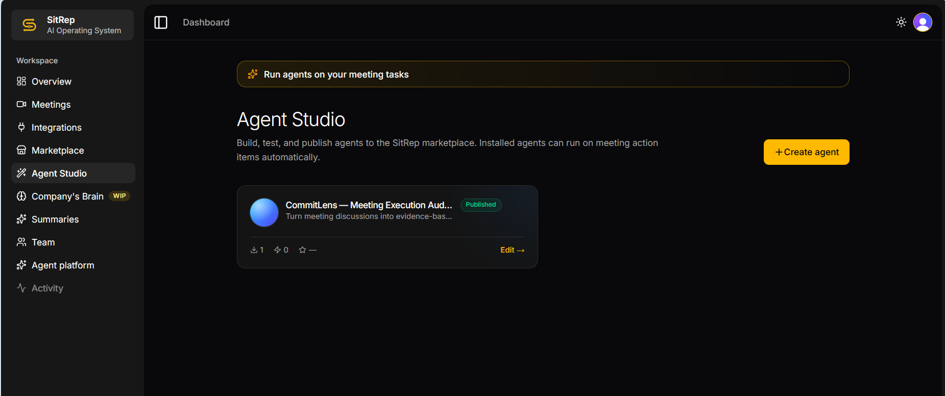
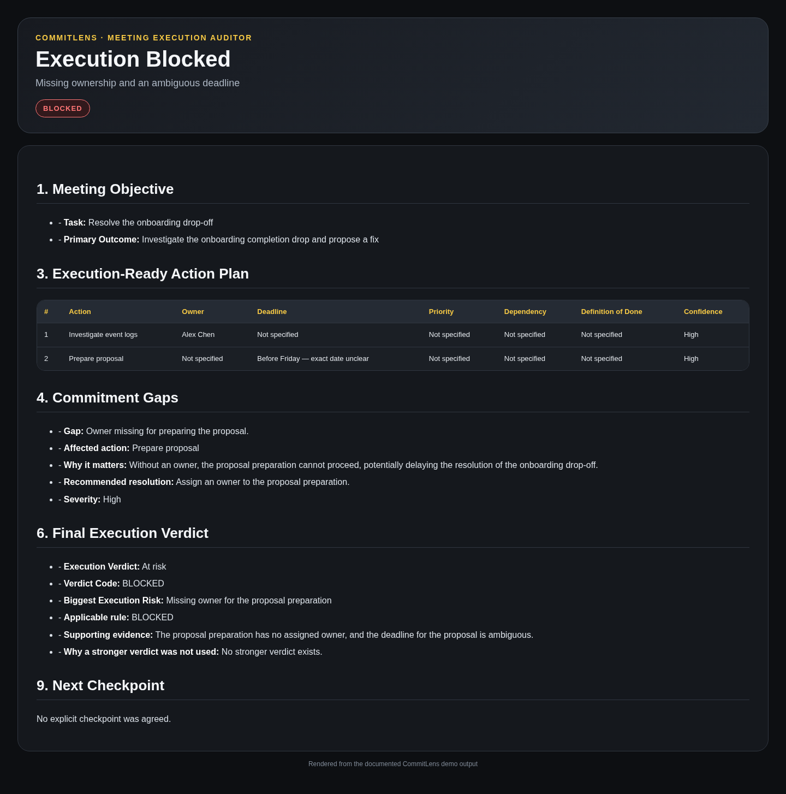
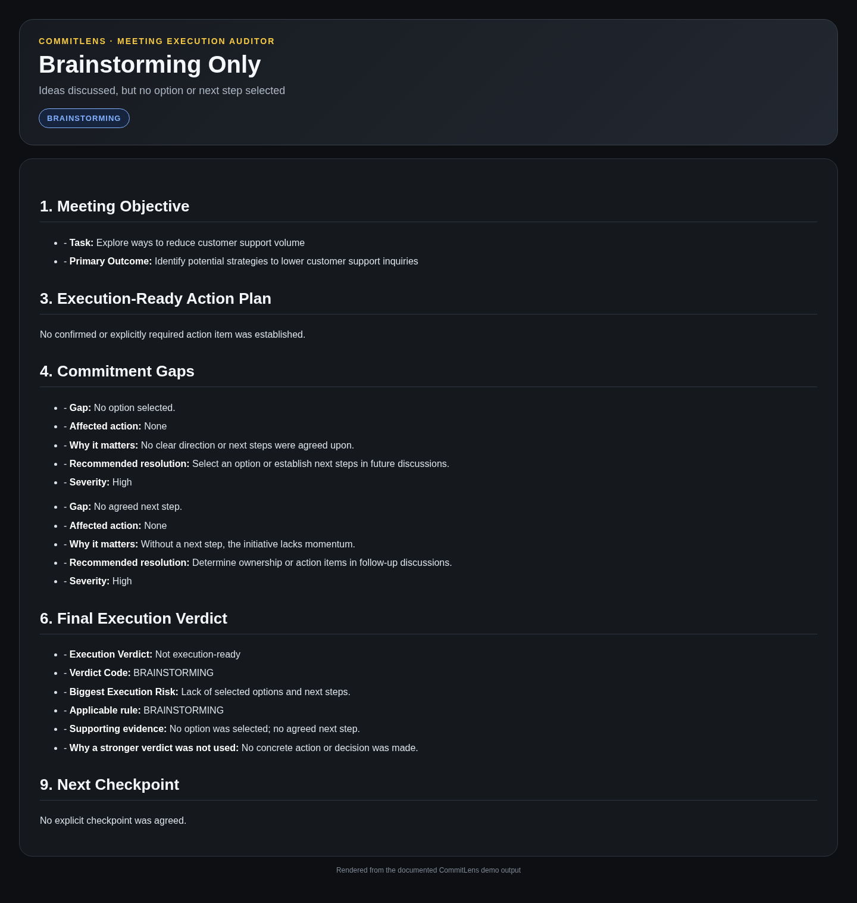
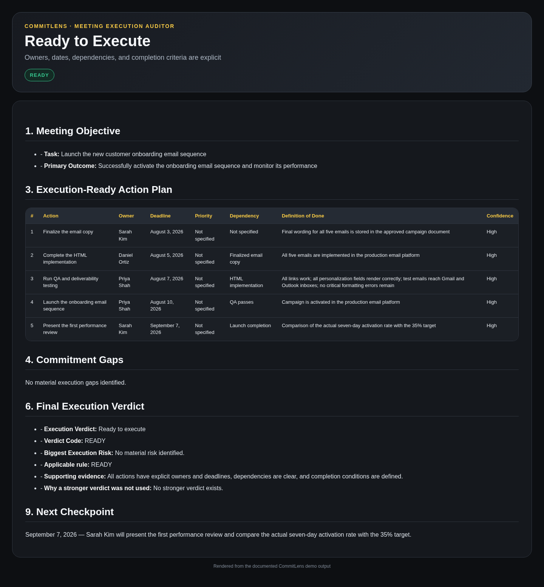

# CommitLens — Meeting Execution Auditor

> Turn meeting discussions into evidence-based, execution-ready commitments.

**Live SitRep Agent:** [Open CommitLens in the SitRep Marketplace](https://app.joinsitrep.com/dashboard/marketplace/commitlens-meeting-execution-auditor--8f9fed5e-8b10-4bd7-af8d-81a9618cc90d)

**Hackathon:** Build the Future of Work with AI Agents  
**Track:** No-Code Agent Track  
**Platform:** SitRep  
**Model:** `gpt-4o-mini — Local (SitRep)`  
**License:** MIT



*CommitLens published successfully through SitRep Agent Studio.*

---

## Overview

Meetings often appear productive while leaving teams with unclear ownership, ambiguous deadlines, unresolved dependencies, and suggestions that are mistakenly treated as commitments.

**CommitLens** is an evidence-first meeting execution auditor built and published on SitRep. It determines what a meeting actually made executable, separates discussion from commitment, and exposes blockers before work begins.

Unlike a conventional meeting summarizer, CommitLens does not assume that every discussed idea became an assigned task.

---

## The Problem

Post-meeting work frequently fails because:

- suggestions are misrepresented as confirmed decisions;
- tasks have no explicit owner;
- deadlines such as “Friday” or “next week” are ambiguous;
- dependencies remain unresolved;
- cancelled or deferred work remains mixed with active commitments;
- follow-up messages communicate more certainty than the meeting supports.

These issues create hidden execution risk even when a meeting summary looks complete.

---

## What CommitLens Produces

CommitLens analyzes a meeting-generated task, meeting context, and optional instructions to produce:

1. A concise meeting objective
2. A structured evidence register
3. Confirmed decisions
4. Explicit commitments and required actions
5. Suggestions and open discussion
6. Cancelled, paused, or deferred work
7. An execution-ready action plan
8. Genuine commitment gaps
9. Conflicts and deadline ambiguities
10. A final execution verdict
11. Targeted clarification questions
12. A ready-to-send follow-up
13. The next confirmed checkpoint

---

## Execution Verdicts

| Verdict | Code | Meaning |
|---|---|---|
| Ready to execute | `READY` | Owners, deadlines, dependencies, and key completion conditions are clear |
| Mostly ready | `MINOR_GAPS` | Core execution details are clear, but minor non-blocking information is missing |
| At risk | `BLOCKED` | A core owner, deadline, conflict, or blocking dependency prevents reliable execution |
| Waiting on dependency | `DEFERRED` | The core outcome is intentionally paused until a named dependency becomes available |
| Not execution-ready | `BRAINSTORMING` | Ideas were discussed, but no option or next step was selected |

---

## Reproducible Demo Scenarios

Every demo includes the exact three fields entered into SitRep Agent Studio:

1. **Task title**
2. **Meeting summary / context the agent receives**
3. **Extra detail**

### Demo 1 — BLOCKED: Missing Owner and Ambiguous Deadline

A proposed fix is required, but no owner was assigned and “before Friday” does not identify a specific date.



**Result**

```text
Execution Verdict: At risk
Verdict Code: BLOCKED
```

- [Exact input](examples/blocked-input.md)
- [Captured output](examples/blocked-output.md)

### Demo 2 — BRAINSTORMING: No False Commitments

Several support-volume ideas were discussed, but no option or next step was selected. CommitLens preserves them as suggestions rather than inventing assigned work.



**Result**

```text
Execution Verdict: Not execution-ready
Verdict Code: BRAINSTORMING
```

- [Exact input](examples/brainstorming-input.md)
- [Captured output](examples/brainstorming-output.md)

### Demo 3 — READY: Fully Execution-Ready Meeting

Every active action has an explicit owner, deadline, dependency, and measurable completion condition.



**Result**

```text
Execution Verdict: Ready to execute
Verdict Code: READY
```

- [Exact input](examples/ready-input.md)
- [Verified reference output](examples/ready-output.md)
- [Original captured output](examples/ready-output-captured.md)

The verified reference output preserves the successful READY result and normalizes Section 9 to the explicit September 7 checkpoint stated in the supplied input. The original captured output is retained for transparency.

---

## Demo Summary

| Scenario | Key condition | Verdict |
|---|---|---|
| Onboarding drop-off | Proposal owner missing; deadline ambiguous | `BLOCKED` |
| Support-volume brainstorming | No selected option; no agreed next step | `BRAINSTORMING` |
| Email-sequence launch | Owners, dates, dependencies, completion criteria, and review point are explicit | `READY` |

---

## Agent Configuration

| Setting | Value |
|---|---|
| Agent type | Prompt / No-Code |
| Model | `gpt-4o-mini — Local (SitRep)` |
| Temperature | `0` |
| Triggers | Custom, Document, Summary |
| Output format | Markdown |

The production instruction set is available in [`prompt.md`](prompt.md).  
The configuration summary is available in [`agent-config.md`](agent-config.md).

---

## Prompt Engineering Principles

CommitLens follows evidence-first safeguards:

- Never infer an owner from a job title, department, or expertise.
- Never turn a suggestion into an explicit commitment.
- Never transfer one action’s deadline to another action.
- Never invent a priority, approval process, budget, or review meeting.
- Preserve ambiguous deadlines rather than creating false calendar dates.
- Keep cancelled or intentionally deferred work outside the active action plan.
- Include required deliverables even when their owners are missing.
- Produce the final verdict only after analyzing evidence, active actions, gaps, and ambiguities.

---

## How to Use CommitLens

1. Open the [published CommitLens agent](https://app.joinsitrep.com/dashboard/marketplace/commitlens-meeting-execution-auditor--8f9fed5e-8b10-4bd7-af8d-81a9618cc90d).
2. Select or create a meeting-generated task.
3. Enter the **Task title**.
4. Paste the **Meeting summary / context**.
5. Add attendees, dates, constraints, or output preferences in **Extra detail**.
6. Run the agent.
7. Review the evidence register, action plan, blockers, clarification questions, and final verdict.
8. Confirm missing information with meeting participants before execution.

---

## Input Contract

### Task title

A concise description of the post-meeting task or intended outcome.

### Meeting summary / context the agent receives

The meeting evidence used by CommitLens, including decisions, statements, commitments, dates, attendees, dependencies, and unresolved discussion.

### Extra detail

Optional instructions such as:

- desired language;
- audience;
- known constraints;
- formatting preferences;
- reminders not to merge separate actions;
- domain-specific context.

CommitLens treats the meeting context as the source of truth and avoids filling missing information with assumptions.

---

## Repository Structure

```text
.
├── README.md
├── LICENSE
├── agent-config.md
├── prompt.md
├── SUBMISSION-CHECKLIST.md
├── examples/
│   ├── README.md
│   ├── blocked-input.md
│   ├── blocked-output.md
│   ├── brainstorming-input.md
│   ├── brainstorming-output.md
│   ├── ready-input.md
│   ├── ready-output.md
│   └── ready-output-captured.md
└── media/
    ├── 01-agent-studio-published.png
    ├── 02-blocked-demo.png
    ├── 03-brainstorming-demo.png
    └── 04-ready-demo.png
```

---

## Why This Is Different from a Meeting Summarizer

A conventional meeting summarizer answers:

> What was discussed?

CommitLens answers:

> What is genuinely executable, what remains unconfirmed, and what must be clarified before work begins?

This distinction matters because fluent summaries can still hide missing ownership, unclear dates, unresolved dependencies, or suggestions that were never approved.

---

## Intended Users

CommitLens is designed for:

- project managers;
- product managers;
- engineering leads;
- operations teams;
- customer-success teams;
- sales teams;
- startup founders;
- cross-functional delivery teams.

---

## Use Cases

- Sprint planning
- Project kickoffs
- Product reviews
- Customer follow-ups
- Leadership meetings
- Launch planning
- Incident follow-ups
- Operational reviews
- Cross-functional projects
- Proposal and submission planning

---

## Limitations

CommitLens is an AI-assisted audit tool. Its output depends on the completeness and accuracy of the supplied meeting context.

The published no-code version uses the SitRep-hosted local `gpt-4o-mini` model. The repository therefore preserves captured outputs and documents the verified READY reference output transparently.

Outputs should be reviewed before being used for high-impact operational decisions.

---

## Privacy and Safety

The demonstration scenarios use fictional names and synthetic business situations.

Do not place API keys, passwords, access tokens, confidential meeting transcripts, personal data, or other secrets in a public repository.

---

## License

This project is released under the [MIT License](LICENSE).

---

## Author

Built by **Ömer Kiraz** for the **Build the Future of Work with AI Agents** hackathon.
